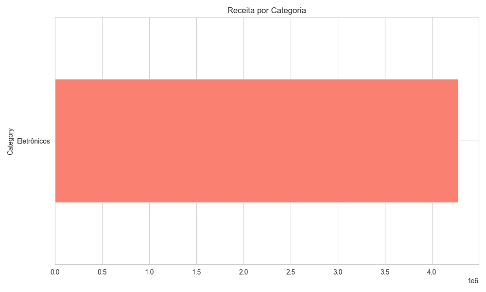
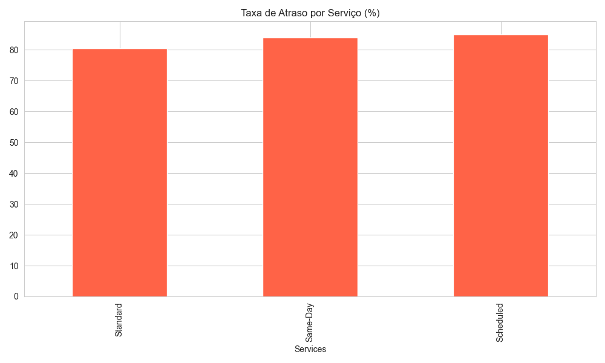
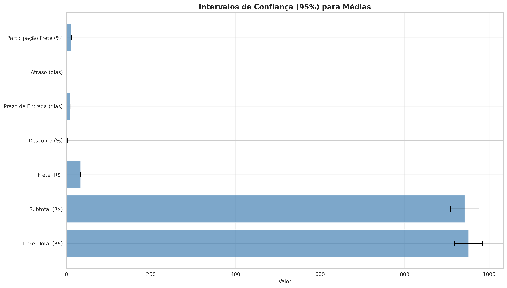
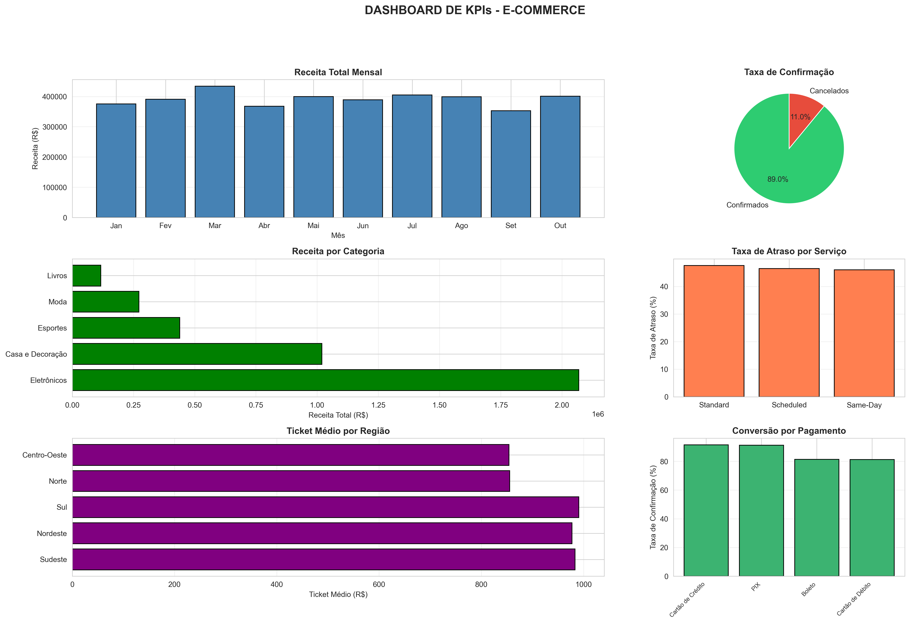

# Relatório de Análise de Dados – E-commerce Brasileiro

**Autores:** Gabriel dos Santos Souza e Leandro de Morais
**Turma:** 3º Período - ADS Embarque Digital
**Data:** 08 de Novembro de 2025

---

## 1. Sumário Executivo

### Divisão de Responsabilidades

Para a execução deste projeto, as responsabilidades foram divididas da seguinte forma:

| Membro da Equipe | Responsabilidades Principais | Notebooks/Fases |
| :--- | :--- | :--- |
| **Gabriel dos Santos Souza** | Limpeza de Dados, Feature Engineering, Análise Exploratória (EDA) | `01_data_cleaning.py`, `02_feature_engineering.py`, `03_exploratory_analysis.py`, `04_eda_temporal_categorical.py` |
| **Leandro de Morais** | Inferência Estatística, Cálculo de KPIs, Geração de Insights, Relatório Analítico | `05_statistical_inference.py`, `06_kpis_insights.py`, Relatório Analítico, README |

| **Leandro de Morais** | Inferência Estatística, Cálculo de KPIs, Geração de Insights, Relatório Analítico |

Este relatório apresenta uma análise aprofundada dos dados de vendas de um e-commerce brasileiro, cobrindo o período de janeiro a outubro de 2024. A análise resultou em insights acionáveis para a direção, com foco em otimização de receita, performance logística e comportamento do cliente. Os principais achados são:

1.  **Otimização de Pagamentos é Crucial para a Receita:** A taxa de cancelamento de pedidos realizados com **Boleto (18.6%)** e **Cartão de Débito (18.7%)** é significativamente mais alta que a de **Cartão de Crédito (8.4%)** e **PIX (8.8%)**. Uma campanha para incentivar o uso de PIX e crédito, ou um sistema de lembretes para pagamento de boletos, poderia recuperar uma parcela significativa da receita perdida.

2.  **Eletrônicos Dominam a Receita, mas com Margens Apertadas:** A categoria de **Eletrônicos** representa **53% da receita total**, impulsionada por um ticket médio altíssimo (R$ 2.762). No entanto, a categoria também possui a maior média de desconto (5.1%), sugerindo uma sensibilidade ao preço. Estratégias de cross-selling com produtos de margem maior, como acessórios, podem aumentar a lucratividade.

3.  **Performance Logística Regional Apresenta Desafios:** A região **Nordeste** registra a **maior taxa de atraso (49.4%)** e o segundo maior custo de frete médio (R$ 36.43), atrás apenas da região Norte. Isso indica gargalos logísticos que podem estar impactando a satisfação do cliente e a recompra. Uma revisão dos parceiros logísticos ou a implementação de um centro de distribuição local são ações recomendadas.

4.  **Sazonalidade de Vendas é Moderada, mas Relevante:** As vendas apresentam um pico em **Março**, tanto em volume de pedidos quanto em receita. Compreender os fatores por trás dessa alta (ex: datas comemorativas, comportamento do consumidor pós-férias) pode permitir a replicação de estratégias bem-sucedidas em outros meses do ano.

---

## 2. Dados e Metodologia

### 2.1. Fonte e Estrutura dos Dados

Para esta análise, foi utilizado um conjunto de dados sintético, gerado para simular as operações de um e-commerce brasileiro com 5.000 pedidos iniciais. O dataset contém informações detalhadas sobre pedidos, clientes, produtos, pagamentos e entregas. As principais colunas incluem:

*   **Identificadores:** `Order_ID`
*   **Datas:** `Order_Date`, `D_Forecast` (previsão), `D_Date` (real)
*   **Geografia:** `UF`, `Region`
*   **Produto:** `Category`, `Subcategory`
*   **Valores:** `Subtotal`, `Discount`, `P_Service` (frete), `Total`
*   **Status:** `Payment_Method`, `Purchase_Status`, `Services`

### 2.2. Preparação e Limpeza dos Dados

O dataset bruto passou por um rigoroso processo de limpeza e preparação para garantir a qualidade e a confiabilidade da análise. As seguintes etapas foram executadas:

1.  **Tratamento de Tipos:** As colunas de data foram convertidas para o formato `datetime`, e as colunas numéricas foram ajustadas para `float` ou `int`.
2.  **Valores Faltantes:** Valores ausentes em `Discount` foram preenchidos com 0 (assumindo ausência de desconto). Em `P_Service` (frete), foram imputados com a mediana do respectivo tipo de serviço. Datas de entrega (`D_Date`) ausentes em pedidos confirmados foram preenchidas com a data prevista para permitir a análise de atraso.
3.  **Remoção de Duplicatas:** Foram identificados e removidos 50 registros duplicados baseados no `Order_ID`, mantendo-se a primeira ocorrência.
4.  **Tratamento de Outliers:** Outliers em variáveis financeiras (`Total`, `Subtotal`, `P_Service`) foram identificados usando o método Z-score (threshold > 3). Um total de 364 registros com valores extremos foram removidos para não distorcer as análises de tendência central e inferência.

Após a limpeza, o dataset final ficou com **4.636 registros**.

### 2.3. Feature Engineering

Novas variáveis foram criadas para aprofundar a análise e permitir o cálculo de KPIs complexos:

*   `delivery_lead_time`: Tempo total entre a data do pedido e a data da entrega.
*   `delivery_delay_days`: Diferença em dias entre a entrega real e a prevista.
*   `is_late`: Flag binário (1/0) que indica se um pedido atrasou.
*   `is_confirmed`: Flag binário (1/0) que indica se o pagamento foi confirmado.
*   `freight_share`: Proporção do valor do frete em relação ao total do pedido.
*   `discount_abs`: Valor absoluto do desconto em Reais.

---

## 3. Análise Exploratória de Dados (EDA)

### 3.1. Distribuições e Medidas de Tendência

A análise das principais variáveis numéricas revela uma forte assimetria à direita, comum em dados financeiros. A média do **Ticket Total** é de **R$ 952,86**, enquanto a mediana é de R$ 497,78, indicando que um menor número de pedidos de alto valor eleva a média geral.

| Métrica               | Ticket Total | Prazo de Entrega (dias) | Atraso (dias) | Desconto (%) |
| --------------------- | ------------ | ----------------------- | ------------- | ------------ |
| **Média**             | R$ 952,86    | 10.1                    | 2.9           | 4.0%         |
| **Mediana**           | R$ 497,78    | 9.0                     | 1.0           | 0.0%         |
| **Desvio Padrão**     | R$ 1.229,15  | 6.9                     | 4.9           | 5.5%         |
| **Mínimo**            | R$ 21,54     | 0                       | -7.0          | 0.0%         |
| **Máximo**            | R$ 7.844,19  | 33                      | 21            | 20.0%        |

*Figura 1: Histogramas de Ticket Total, Prazo de Entrega e Atraso.*

### 3.2. Análise de Correlações

A matriz de correlação mostra, como esperado, uma correlação quase perfeita entre `Subtotal` e `Total` (0.97). Uma correlação negativa fraca entre `Discount` e `Total` (-0.11) sugere que descontos maiores não necessariamente levam a um aumento do ticket total, podendo estar associados a produtos de menor valor.

*Figura 2: Heatmap de correlação entre as principais variáveis numéricas.*

### 3.3. Análise Categórica

**Receita por Categoria:** A categoria de **Eletrônicos** é a principal fonte de receita, seguida por **Casa e Decoração**. Livros, apesar de terem um alto volume de pedidos, contribuem com a menor parcela da receita devido ao baixo ticket médio.

*Figura 3: Análise de Receita, Ticket Médio e Desconto por Categoria.*

**Performance Logística:** O serviço **Standard** é o mais utilizado (70% dos pedidos confirmados), com o frete mais baixo, porém o maior prazo de entrega. O serviço **Same-Day**, embora mais caro, cumpre a promessa de entrega rápida. A taxa de atraso, no entanto, é similar entre os três serviços, pairando em torno de 47%.

*Figura 4: Comparativo de Frete, Prazo e Atraso por tipo de serviço.*

---

## 4. Inferência Estatística

Para validar os achados e fazer generalizações para a população de clientes, foram realizados testes de hipóteses e calculados intervalos de confiança (ICs) com 95% de confiança.

### 4.1. Verificação de Suposições

Os testes de normalidade (Shapiro-Wilk, D'Agostino-Pearson) rejeitaram a hipótese de normalidade para todas as variáveis financeiras e de tempo (p < 0.05). No entanto, devido ao grande tamanho da amostra (n > 30), o Teorema do Limite Central nos permite prosseguir com os testes paramétricos, como o Teste t, com robustez.

### 4.2. Intervalos de Confiança (IC 95%)

Os ICs fornecem uma faixa de valores prováveis para as médias e proporções da população.

*   **IC para Ticket Médio Total:** Com 95% de confiança, o ticket médio de todos os clientes do e-commerce está entre **R$ 915,64 e R$ 990,08**.
*   **IC para Taxa de Atraso:** A verdadeira taxa de atraso da operação logística está entre **45.68% e 48.73%**.
*   **IC para Taxa de Confirmação:** A proporção de pedidos que são efetivamente pagos e confirmados está entre **88.09% e 89.89%**.

*Figura 5: Intervalos de confiança de 95% para as principais métricas de média.*

### 4.3. Testes de Hipóteses

*   **Taxa de Confirmação vs. Método de Pagamento:** O teste Qui-Quadrado mostrou uma **associação estatisticamente significativa** (p < 0.001) entre o método de pagamento e a confirmação do pedido. Isso confirma que a diferença nas taxas de confirmação entre Boleto/Débito e Crédito/PIX não ocorre ao acaso.

*   **Ticket Médio vs. Categoria:** O teste ANOVA revelou **diferenças estatisticamente significativas** (p < 0.001) no ticket médio entre as diferentes categorias de produtos, validando que `Eletrônicos` possuem um ticket médio estruturalmente maior que as demais.

---

## 5. KPIs e Insights de Negócio

O dashboard abaixo consolida os principais KPIs (Key Performance Indicators) e direciona para os insights mais relevantes.

*Figura 6: Dashboard consolidado com os principais KPIs do negócio.*

### Principais KPIs

| Categoria         | KPI                     | Valor                  |
| ----------------- | ----------------------- | ---------------------- |
| **Financeiro**    | Receita Total (Confirmada) | R$ 3.915.541,69        |
|                   | Ticket Médio            | R$ 952,86              |
|                   | Take-rate de Frete      | 3.48%                  |
| **Operacional**   | Taxa de Confirmação     | 88.95%                 |
|                   | Taxa de Cancelamento    | 11.05%                 |
| **Logístico**     | Prazo Médio de Entrega  | 10.1 dias              |
|                   | Taxa de Atraso          | 47.20%                 |

### Insights Acionáveis

1.  **Ação em Pagamentos:** A diferença de mais de 10 pontos percentuais na taxa de confirmação entre Boleto/Débito e PIX/Crédito é um ponto de atenção. **Recomendação:** Implementar um sistema de recuperação de boletos não pagos (ex: lembretes por e-mail/WhatsApp) e promover o PIX com pequenos incentivos (ex: cashback ou desconto no frete).

2.  **Estratégia de Mix de Produtos:** A alta concentração de receita em Eletrônicos (53%) cria uma dependência. **Recomendação:** Fomentar o crescimento de categorias com boa margem e ticket médio crescente, como **Casa e Decoração** (26% da receita), através de campanhas de marketing direcionadas e kits de produtos (bundles).

3.  **Otimização Logística:** A taxa de atraso de 47% é um ponto crítico que afeta a experiência do cliente. A região Nordeste é a mais impactada. **Recomendação:** Renegociar SLAs (Service Level Agreements) com as transportadoras, diversificar parceiros logísticos na região Nordeste e avaliar a viabilidade de um mini centro de distribuição para reduzir o *lead time*.
